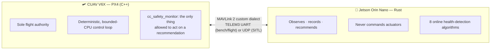
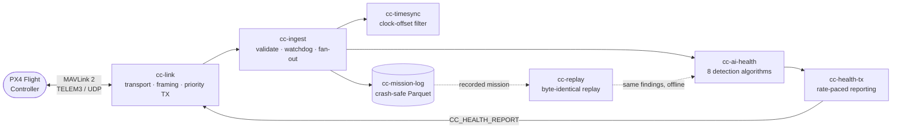

<div align="center">

# drone-companion

**A Rust companion-computer stack that talks to PX4 over a custom, safety-first MAVLink 2 dialect.**

[](https://www.rust-lang.org)
[](https://github.com/elliott-dp/PX4-Autopilot-CCFC)
[](#license)
[](#testing--determinism)
[](#testing--determinism)

</div>

---

## What is this?

`drone-companion` is the software that runs on a **Jetson Orin Nano** strapped
to a drone, talking over a wire to a **CUAV V6X flight controller** running
[PX4](https://px4.io). It ingests flight telemetry, watches the vehicle's
health with its own statistical/physics models, records every flight to disk
in a crash-safe format, and reports its findings back — all in Rust, all
deterministic, all built so that **the flight controller flies perfectly fine
even if this entire computer catches fire.**

Think of it as the "smart" half of a two-brain drone: PX4 is the reflexive,
paranoid brain that keeps the vehicle in the air no matter what happens on the
companion side; the Jetson is the analytical brain that watches, learns, and
recommends — but never commands.



---

## The one rule everything else follows

> **PX4 is the sole flight authority.** The companion computer never commands
> actuators and never holds state PX4 needs to fly. It can only *recommend*
> (hold position, land, return home); PX4's own deterministic policy table
> decides whether to listen. If the Jetson crashes, reboots, freezes, or
> starts lying, the vehicle keeps flying exactly as before — it just loses the
> smart features.

That rule is enforced by construction, not by convention:

- **Fixed-size messages, no dynamic allocation** on the PX4 side of the link —
  a companion sending garbage or a flood of messages can't grow unbounded
  memory or stall the control loop.
- **Missing data stays missing.** No side ever fabricates, interpolates, or
  guesses a value for a stale or absent stream — a gap in the data is reported
  as a gap, never silently smoothed over.
- **Safety traffic is never queued behind bulk data.** Heartbeats, time sync,
  and health reports use strict-priority queues so they can never be starved
  by telemetry volume.
- **Every finding carries a confidence score**, never a bare true/false — the
  companion is explicit about how sure it is, and PX4's policy table can weigh
  that instead of trusting a black box.
- **PX4 keeps its own local blackbox log (ULog) in every mode** — a Jetson
  failure can never mean "no flight log exists."

---

## Architecture: how data actually flows



Every arrow above is a real crate boundary — not a metaphor. `cc-ingest` is
the only thing that touches raw wire data; everything downstream of it only
ever sees a validated, typed `TelemetryEvent`.

---

## The 8 health-detection algorithms

No black-box machine learning anywhere in this system — every algorithm below
is closed-form statistics or physics, chosen so a human can always trace a
finding back to the formula that produced it. Each one is its own file, each
one ships synthetic-trace tests (a benign flight must produce **zero**
findings, an injected fault must be caught), and each one is documented inline
with the reasoning behind its design, not just what it does.

| # | Algorithm | Watches | Core idea |
|---|---|---|---|
| 1 | **`battery_model`** | Pack voltage under load | Predicts cell voltage from an OCV-lookup + Arrhenius-temperature internal-resistance model, so a healthy hard-climb sag or a cold pack is *predicted, not flagged* — only sag the model can't explain is anomalous. |
| 2 | **`vibration_anomaly`** | IMU accel / gyro / coning | Regresses each of the three (genuinely different) vibration metrics against throttle, so vibration that rises with rotor speed is expected; only the *unexplained* residual trips a change-point detector. |
| 3 | **`estimator_consistency`** | EKF innovation ratios | Learns each channel's own healthy baseline and watches for drift *above it* — so aggressive-but-healthy flight riding 0.5–0.8 innovation ratios is never flagged, only a genuine climb toward PX4's own 1.0 rejection threshold. |
| 4 | **`gps_quality`** | Fix, sats, eph/epv, jamming | A panel of per-indicator detectors fused by *cause independence* — GPS geometry and RF interference can't corroborate each other, so escalation to CRITICAL needs two genuinely separate causes, not one noisy field. |
| 5 | **`motor_balance`** | Actuator command symmetry | No RPM/current telemetry exists, so this is honestly advisory-only — but it separates a *weak motor* from *wind* by checking whether the asymmetry rotates with heading (wind) or stays fixed to the airframe (a fault). |
| 6 | **`link_quality`** | Message cadence & gaps | Reconstructed purely from fields that are actually recorded to disk (sequence gaps, receive timestamps) — deliberately ignores live-only signals like RTT, so replaying a flight reproduces identical link findings. |
| 7 | **`thermal_monitor`** | Battery & IMU temperature | Despikes then watches both an absolute limit and rate-of-rise — the rate check only arms above a floor, so a cold-start warm-up ramp can't be mistaken for thermal runaway. |
| 8 | **`mission_risk`** | Energy-to-home reserve | Learns cruise power and speed in flight, tracks distance home, and projects the state of charge you'd land with — closing the gap between "battery is at 18%" and "18% isn't enough to get home." |

Every finding merges into one conclusion with two hard-coded safety rules: the
**highest-severity** finding wins (never an averaged mix), and **RTL is only
ever recommended when GPS and the estimator are both healthy** — a
navigation-trusting action is automatically downgraded to `Land` otherwise.

---

## Repository map

```
drone-companion/
├── crates/
│   ├── cc-protocol       MAVLink 2 dialect bindings + wire-format proof (golden vectors)
│   ├── cc-link           transport (UDP/serial), framing, priority TX queues, heartbeat
│   ├── cc-timesync       RTT-filtered clock-offset estimator
│   ├── cc-ingest         decode → validate → per-stream staleness watchdog → fan-out
│   ├── cc-config         layered config: file → environment → CLI overrides
│   ├── cc-mission-log    crash-safe, replayable Parquet flight recorder
│   ├── cc-health-tx      rate-paced, hysteresis-smoothed CC_HEALTH_REPORT sender
│   ├── cc-ai-health      the 8 deterministic health-detection algorithms + framework
│   └── cc-replay         replay a recorded mission through the exact algorithms that ran live
├── apps/
│   ├── companiond        the daemon that actually runs on the Jetson
│   ├── log-inspect       verify a mission dataset — Clean / Dirty / Corrupt
│   └── replay-mission    CLI: run a replay, diff two runs, audit for false positives
├── cc-dialect/           the custom MAVLink XML both sides generate their bindings from
├── docs/                 a written design doc + committed test evidence for every phase
└── tools/                SITL test harnesses (drive a simulated PX4 instance end to end)
```

The flight-controller side of this project — the PX4 module that enforces the
policy table and is the only thing that ever acts on a recommendation — lives
in a separate fork:
**[PX4-Autopilot-CCFC](https://github.com/elliott-dp/PX4-Autopilot-CCFC)**,
pinned to PX4 release **`v1.17.0`**.

---

## The protocol

Everything on the wire is a real MAVLink 2 message, generated from one XML
definition (`cc-dialect/cc_dialect.xml`) shared by both the C++ (PX4) and Rust
(companion) sides — so the two can never silently disagree about a field
layout. A build-time hash of that XML (`dialect_hash`) travels in every
mission's manifest, so a recorded flight can never be misread by bindings
generated from a different version of the contract.

| ID | Message | Direction | Carries |
|---|---|---|---|
| 54000 | `CC_TELEMETRY_STATE` | FC → CC | attitude, rates, position/velocity NED, arming/nav state |
| 54001 | `CC_TELEMETRY_IMU` | FC → CC | accel/gyro, delta-angle, vibration metrics, clipping count |
| 54002 | `CC_TELEMETRY_POWER` | FC → CC | voltage, current, remaining %, cell count, PX4 warning level |
| 54003 | `CC_TELEMETRY_GPS` | FC → CC | fix type, satellites, eph/epv, jamming/noise indicators |
| 54004 | `CC_TELEMETRY_ESTIMATOR` | FC → CC | EKF innovation test ratios, solution status flags |
| 54005 | `CC_TELEMETRY_ACTUATOR` | FC → CC | normalized per-motor output commands |
| 54006 | `CC_EVENT` | FC → CC | discrete flight events |
| 54007 | `CC_SAFETY_STATUS` | FC → CC | policy-table state, last acknowledged report sequence |
| 54010 | `CC_HEALTH_REPORT` | CC → FC | severity, recommended action, detail code, confidence |
| 54011 | `CC_AI_DIAGNOSTIC` | CC → FC | evidence stream for a health finding (value/limit) |
| 54012 | `CC_MISSION_CONTEXT` | FC → CC | mission id, home position, distance-to-home basis |
| 54013 | `CC_LOG_CONTROL` | FC → CC | mission-log lifecycle (start/stop/rotate) |

Golden-vector tests fix every field of every message and round-trip them
through both the generated C headers and the generated Rust bindings on every
test run — if a future XML edit ever silently changes wire semantics, this is
the test that catches it.

---

## Getting started

```bash
git clone git@github.com:elliott-dp/drone-companion.git
cd drone-companion
cargo build --workspace
cargo test --workspace
```

No external services, no hardware required for any of the above — the entire
stack is proven first against a simulated flight controller (SITL) before it
ever touches a real board.

**Run the daemon** against a live or simulated PX4 instance, health detection
included:

```bash
cargo run -p companiond -- \
  --udp-bind 127.0.0.1:24540 --remote 127.0.0.1:24040 \
  --ai-health
```

**Verify a recorded flight's integrity:**

```bash
cargo run -p log-inspect -- /path/to/mission_000123
```

**Replay a flight's health findings** (byte-identical to what ran live) and
check for false positives:

```bash
cargo run -p replay-mission -- run   /path/to/mission_000123 --json
cargo run -p replay-mission -- diff  /path/to/run_a /path/to/run_b
cargo run -p replay-mission -- audit /path/to/benign_mission_*
```

---

## Testing & determinism

- **Determinism is a hard requirement, not a nice-to-have.** The health
  algorithms use only an integer logical clock, fixed-order floating-point
  reductions, and one cross-platform math library (`libm`) instead of the
  host's own transcendentals — so replaying a recorded flight on a *different
  machine* reproduces **byte-identical** findings. This is asserted directly:
  `cc-replay` re-runs a Parquet-recorded mission and hashes the result against
  an in-memory run of the same events — the two must match exactly.
- **Golden vectors** lock the wire format: a fixed set of MAVLink frames,
  generated once from the shared XML, decoded and re-encoded by both the C and
  Rust bindings on every test run.
- **Every failure mode ships its own drill.** A dead link, a corrupt Parquet
  write mid-flush, a full disk, a stuck sensor, a GPS jamming event, a torn
  motor command — each has a test that induces it and asserts the recovery.
- **A benign flight must produce zero findings.** Every algorithm has a
  synthetic "healthy" trace test, and the whole 8-algorithm registry is also
  driven together through a full 45-second multi-stream trace with the
  assertion that nothing warns — the pipeline-level false-positive proof.
- **The safety policy table that runs on PX4 ships with 100% branch
  coverage**, tested entirely on the host — no simulator needed to prove its
  logic is exhaustive.

**198 tests, all green, `cargo clippy --workspace` clean.**

| Crate | Tests | | Crate | Tests |
|---|---|---|---|---|
| `cc-ai-health` | 93 | | `cc-protocol` | 31 |
| `cc-mission-log` | 29 | | `cc-config` | 13 |
| `cc-health-tx` | 13 | | `cc-timesync` | 7 |
| `cc-ingest` | 5 | | `cc-replay` | 4 |
| `cc-link` | 3 | | | |

Autonomy is gated deliberately: every `CRITICAL` the health algorithms can
emit is **advisory only** until a false-positive audit runs over real,
recorded benign flights (not just synthetic traces) — until that documented
audit passes, PX4's policy table stays warn-only on these findings by
configuration, never acting on them alone.

---

## Project status

Built in phases, each one landing something demonstrable before the next
begins — nothing flight-facing ships before its simulated equivalent works,
and nothing touches real hardware before its bench equivalent works.

| Phase | Goal | Status |
|---|---|---|
| 0 | Repos, toolchains, shared dialect, CI skeleton | ✅ done |
| 1 | Protocol layer proven on the bench — C and Rust agree byte-for-byte | ✅ done |
| 2 | PX4 uORB → MAVLink telemetry publisher (SITL) | ✅ done |
| 3 | MAVLink streams out + receiver in, over simulated UDP | ✅ done |
| 4 | Rust `cc-link` + `cc-timesync` + `cc-ingest` proven against SITL | ✅ done |
| 5 | `cc-mission-log` + `cc-config` + process supervision | ✅ done |
| 6 | `cc_safety_monitor` (PX4) + `cc-health-tx` — the safety loop closes | ✅ done |
| 7 | `cc-ai-health` + `cc-replay` — the 8 detection algorithms | ✅ done |
| 8 | Bench HITL: a real V6X ↔ a real Jetson over TELEM3 | 🔜 next |
| 9 | Staged flight testing — passive, then gating, then acting | 🔜 planned |

See [`docs/development_plan.md`](docs/development_plan.md) for the full plan
with every phase's detailed steps and exit criteria, and `docs/phaseN/` for a
written design doc plus committed test evidence for each phase already
shipped.

---

## License

Licensed under either of [MIT](LICENSE-MIT) or
[Apache License, Version 2.0](LICENSE-APACHE) at your option.
