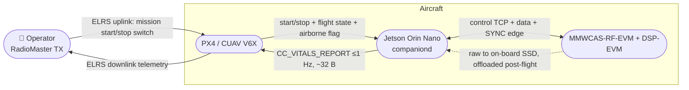

# Phase 10 (proposed) — the radar harness: MMWCAS ↔ Jetson link, and an environment any pipeline can be built in

> **Status: design proposal. No code has shipped for this phase.**
>
> **What Phase 10 delivers:** a *harness*, not an algorithm.
> 1. The radar↔Jetson link works, deterministically, with known timing.
> 2. Everything is recorded — compressed raw plus every synchronised context
>    channel — in an organised, documented, tool-agnostic dataset.
> 3. Any signal-processing or ML pipeline (Rust, Python, MATLAB) can be attached
>    to that data **offline or online, without touching the recorder**.
>
> **Explicitly out of scope:** implementing the vital-signs or detection
> algorithms. §D and the companion survey enumerate what they could be and what
> must be tested; choosing and building them is Phase 11+ work, done *against*
> this harness.

**Companion documents**

| Document | Covers |
|---|---|
| [`radar_transport_and_sync.md`](radar_transport_and_sync.md) | The four possible data paths off the RF-EVM, the control plane, and the timing/sync architecture with its measured-vs-assumed budget |
| [`radar_dataset_and_storage.md`](radar_dataset_and_storage.md) | The dataset layout, schemas, **measured compression results**, ground-truth channels, and readers for Rust / Python / MATLAB |
| [`radar_dsp_ml_survey.md`](radar_dsp_ml_survey.md) | The extensive algorithm survey: every stage, its alternatives, the ML landscape, and what should and should not be tested |
| [`radar_realtime_budget.md`](radar_realtime_budget.md) | Hard/soft/best-effort task classes, the compute budget with arithmetic, and the answer to "will the monitoring tier overload the CC?" |

**Sourcing tags** used throughout: **[calc]** arithmetic done here · **[meas]**
measured on this machine · **[code]** read from source code or project
documentation on GitHub · **[corrob]** multiple independent search extracts,
primary document not read · **[unver]** single source or inference.
`ti.com`, `arxiv.org`, `ieeexplore`, `pmc.ncbi.nlm.nih.gov`, `ecfr.gov`,
`docs.nvidia.com`, `expresslrs.org` and `docs.px4.io` are all blocked by this
session's egress policy; **only GitHub was reachable**, so [code] facts are the
strongest class available here and §H lists what must still be opened.

---

## Part A — Roles: who does what



| Component | Responsibility | Explicitly **not** its job |
|---|---|---|
| **Operator / RadioMaster** | Starts and stops the mission with a switch; reads presence + vital signs on the handset/GCS | — |
| **PX4 (FC)** | Relays the start/stop intent to the companion; supplies flight state and the airborne flag; forwards and logs `CC_VITALS_REPORT`; keeps flying | Any processing, any decision, any policy on radar content. Radar never enters `cc_safety_monitor`. |
| **Jetson (CC)** | Owns the radar: configure, trigger, capture, timestamp, compress, record, derive the live product, report | Commanding the aircraft |
| **Radar** | Chirps and produces raw ADC | Deciding anything |

### A.1 The FC contract, in full

**FC → CC, mission start/stop.** The pilot's switch travels RadioMaster → ELRS
uplink → PX4. Two routes, and the recommendation is to build both because they
cost almost nothing:

| Route | Mechanism | Verdict |
|---|---|---|
| **Primary** | PX4's onboard stream set already includes `RC_CHANNELS`; the companion reads an AUX channel and edge-detects it **[corrob]** | **Zero PX4 code.** Build this first. |
| Hardening | A `CC_PAYLOAD_COMMAND` in the CC dialect, emitted by the fork on an RC edge, carrying an explicit command + monotonic sequence | Better semantics (debounce and edge detection live where the RC data lives), but needs fork code. Phase 10.3. |

Failure semantics, which matter more than the mechanism:

* **RC lost ⇒ never start a capture.** An unknown switch position holds the
  current state; it does not begin one. Stopping on RC loss is a configuration
  choice (`on_rc_loss = hold | stop`), defaulting to `hold` so a brief dropout
  does not truncate a 30 s dwell.
* Every transition is recorded with its source (`rc_edge`, `dialect_cmd`,
  `operator_gcs`, `auto_timeout`) — so the dataset can always answer *why* a
  dwell started.
* The **airborne-transmit interlock overrides start** unconditionally (§A.2).

**CC → FC → operator, the report.** One compact fixed-size message, ≤ 1 Hz:

| Field | Bytes | Notes |
|---|---|---|
| `sequence` | 4 | monotonic per `cc_boot_id` |
| `dwell_id` | 4 | joins the downlink to the recorded dataset |
| `human_present` | 1 | the bool the operator actually wants |
| `n_tracks` | 1 | |
| `best_range_dm` | 2 | decimetres, best track |
| `best_azimuth_cdeg` | 2 | centidegrees |
| `resp_rpm_x10` | 2 | 0 = no estimate (never a fabricated value) |
| `resp_confidence` | 1 | 0–100 |
| `heart_bpm_x10` | 2 | 0 = no estimate |
| `heart_confidence` | 1 | 0–100 |
| `dwell_secs_elapsed` | 1 | lets the operator see the 30 s window filling |
| `quality_flags` | 2 | motion-corrupted, clutter-dominated, window-incomplete, clock-unlocked… |
| `payload_state` | 1 | IDLE / CONFIGURING / CAPTURING / INHIBITED / FAULT |
| `schema_version` | 1 | |
| **total payload** | **25** | ~37 B on the wire with MAVLink 2 framing **[calc]** |

Sized against measured ELRS MAVLink-mode bandwidth **[code, ExpressLRS docs]** —
MAVLink mode forces a 1:2 telemetry ratio:

| ELRS mode | Downlink | One 37 B report at 1 Hz costs |
|---|---|---|
| 2.4 GHz F1000 | ~2375 B/s | 1.6 % |
| 2.4 GHz 333 Hz Full | ~1470 B/s | 2.5 % |
| 900 MHz K1000 Full | ~4420 B/s | 0.8 % |
| 900 MHz 200 Hz Full | ~880 B/s | 4.2 % |
| 2.4 GHz 50 Hz | ~110 B/s | **34 %** |

⇒ 1 Hz is comfortable except on the slowest modes, where the design must fall
back to a 8-byte summary (presence + two rates + flags) at 0.2 Hz. That
degradation is a requirement, not an optimisation: the link budget is shared with
all of PX4's own telemetry.

Two operator-display realities to bench-test early (§H): ELRS converts MAVLink
telemetry into CRSF sensors for EdgeTX, so a **custom dialect message will not
render on the handset** — a GCS (QGroundControl on a tablet) speaking the CC
dialect will. Mirroring 2–3 scalars into standard messages is the pragmatic path
for handset visibility. Also, in MAVLink mode the FC waits to be asked for
streams, so EdgeTX can show nothing until a GCS connects **[code, ELRS
discussion]** — plan for the GCS-less case explicitly.

### A.2 The one hard gate: airborne transmit inhibit

Unchanged from the previous revision of this document, and it survives the
reframing intact, because it is a legal constraint rather than an engineering
one: **47 CFR § 95.3333 prohibits 76–81 GHz radar aboard aircraft in flight and
requires "a mechanism that will prevent operations once the aircraft becomes
airborne"** **[corrob, two independent CFR extracts]**. § 95.3331's permitted-use
list is closed (vehicular; airport air-operations-area; aircraft-mounted for
**ground use only**), and 60 GHz is closed for aircraft too. In the EU the
harmonised 76–81 GHz designation is scoped to ground-based vehicle and
infrastructure radar, so a UAV payload falls outside the exemption **[unver]**.

```
permit_tx(airborne_state, rc_command, authorization, config) -> Permit | Inhibit(reason)
```

* `airborne_state` derives from PX4 (`arming_state` / `nav_state` / landed
  state) — **fail-safe: unknown or stale ⇒ Inhibit.**
* Airborne transmit requires a configured authorization identifier (e.g. an FCC
  Part 5 experimental grant reference), recorded into the manifest. Absent it,
  airborne ⇒ Inhibit, logged and surfaced in the report's `payload_state`.
* Exhaustive host-side truth table, in the style the `cc_policy_table` already
  established.

This gate is *why* the harness is worth building first: **ground, tripod and
tethered work is lawful and is where every algorithm gets developed** — and it is
also where the physics is easiest. The harness makes that phase produce data that
the airborne phase can be compared against.

---

## Part B — Architecture

### B.1 The two-path principle

The single most important architectural fact: **the reliable recording path and
the real-time path are different paths, and that is fine.**

| | Path R — bulk record | Path L — live tier |
|---|---|---|
| Producer | TDA2 capture to on-board SSD (TI-supported) | TDA2 Ethernet stream, or the Orin's own DSP over a reduced raw stream |
| Content | Full-rate raw ADC, every dwell | Reduced, *unselected* complex product + derived tracks/rates |
| Purpose | The dataset. ML training. Any future algorithm. | Operator display, `CC_VITALS_REPORT`, "is the payload alive" |
| Latency | Post-flight offload | ≤ ~200 ms |
| If it fails | Mission is scientifically dead → treat as a hard fault | Degrade silently; the record is unaffected |

They are joined by the **frame index and the SYNC edge ledger**, not by
timestamps alone (see [`radar_transport_and_sync.md`](radar_transport_and_sync.md)).
Whether the TDA2 can do both at once is an open bench test — and if it cannot,
the fallbacks are documented there, including capturing CSI-2 directly into the
Orin and dropping the TDA2 entirely.

### B.2 Crates (harness only — no algorithms)

```
crates/
  cc-radar/            control plane: TCP:5001 session, mmwavelink-equivalent
                       configure/arm/start/stop sequence, profile+calibration
                       hashing, dwell FSM, airborne-inhibit gate, *_idx.bin parser
  cc-radar-sync/       the timing domain: SYNC edge capture via Tegra HTE,
                       frame-index ledger, radar<->CC offset estimate + quality
  cc-radar-io/         frame ingest (Path L), bounded queues, zero-copy ring
  cc-radar-store/      the recorder: transform + zstd shards, Parquet index,
                       manifest, integrity, offload/verify
  cc-radar-pipe/       *** the extension point ***: PipelineStage trait, the
                       shared-memory/IPC bridge, and the offline driver
apps/
  radar-harness        the daemon-side binary (or a companiond subsystem)
  radar-inspect        dataset verification: index<->shard consistency, gap and
                       coherence reporting, checksum verify, dwell completeness
  radar-replay         feed any recorded dwell to a pipeline, at rate or as fast
                       as possible, live-identical
tools/phase10/
  fake_radar.py        control-plane test double + synthetic frame producer
  pipelines/           reference stubs: rust/, python/, matlab/ (no algorithms —
                       each just proves the contract end to end)
```

### B.3 The pipeline extension point (the part the user actually asked for)

The harness must let a pipeline be written in **Rust, Python or MATLAB**, run
**offline or online**, and be swapped without touching the recorder. Three
attachment modes, all fed by one canonical frame representation:

| Mode | Mechanism | For |
|---|---|---|
| **Offline** (default, always available) | `radar-replay` reads a recorded dwell and hands frames to a pipeline process; or the pipeline reads the dataset directly with the documented readers | Algorithm development, ML training, MATLAB prototyping, regression |
| **Online, out-of-process** | Frames published into a **shared-memory ring buffer** (`/dev/shm`, fixed slot size, sequence-numbered, single writer / many readers, readers may fall behind and are told so) + a small control socket | Python/MATLAB pipelines that must run live but must never be able to stall the recorder |
| **Online, in-process** | A Rust `PipelineStage` trait, same lifecycle as the offline driver | Low-latency Rust stages that feed `CC_VITALS_REPORT` |

The contract that makes all three equivalent:

```rust
pub trait PipelineStage: Send {
    fn on_frame(&mut self, f: &RadarFrameView) -> StageOutput;   // fold; must not block
    fn on_dwell_start(&mut self, d: &DwellMeta);
    fn on_dwell_end(&mut self, d: &DwellMeta) -> Option<DwellResult>;
}
```

Non-negotiable properties, each inherited from a lesson the repo already learned:

1. **A pipeline can never back-pressure the recorder.** Readers are lossy; a
   slow reader misses frames and is *told* how many (the `broadcast::Lagged`
   pattern already used for the mission log).
2. **Frames handed to a pipeline are exactly what was recorded**, bit for bit —
   so an online result is always reproducible offline. Any stage that wants to
   consume something else must record it first.
3. **The pipeline's identity is recorded**: name, version, git hash, config hash,
   and for ML the model hash. A `radar_vital_estimate` row without a pipeline
   identity is worthless six months later.
4. **Every output is timestamped in the recorded time base**, never in wall
   clock, so `radar-replay` reproduces it exactly.
5. **Language parity is proven by a test, not by intent**: `tools/phase10/pipelines/`
   holds a trivial stage in each of Rust, Python and MATLAB, and CI asserts all
   three produce byte-identical output on a committed fixture dwell.

---

## Part C — Answers to the four questions raised

### C.1 "Will the streamed pre-processed tier be expensive for CPU load? Won't my ML pipeline overload the CC?"

**Not from the DSP — and the numbers are not close.** Full arithmetic in
[`radar_realtime_budget.md`](radar_realtime_budget.md); the summary **[calc]**:

| Stage, per frame at 20 Hz (12 TX × 16 RX × 16 loops × 256 samples) | Cost |
|---|---|
| Range FFT (3072 × 256-pt) | 629 MFLOP/s |
| Doppler FFT (49 152 × 16-pt) | 315 MFLOP/s |
| Angle FFT (4096 × 256-pt) | 839 MFLOP/s |
| **Total classic DSP** | **≈ 1.8 GFLOP/s** |
| Orin Nano GPU FP32 peak | ≈ 1.3 TFLOP/s → DSP is **~0.14 % of peak**, ~1–2 % at realistic efficiency |
| Memory traffic (≈8 passes over 3 MiB at 20 Hz) | ≈ 0.6 GB/s of 68 GB/s ≈ **0.9 %** |
| Lossless compression of the raw stream | **< 0.5 CPU core** [meas-derived] |

So the monitoring tier is nearly free, and **the reason to keep it is not
convenience — it is that an operator with no live product cannot tell a working
payload from a dead one, and a 30 s dwell wasted on nothing is expensive.**

What *can* overload the Orin Nano — and the harness must budget each explicitly:

* **An unbudgeted ML model on the full cube.** A 2D model on a range-Doppler map
  (~1–2 GFLOP/inference) is ~2 % of FP32 peak at 20 Hz; a 3D model over
  256 × 64 × 192 cells is easily 100–500 GFLOP/inference = **2–10 TFLOP/s at
  20 Hz, i.e. beyond the device** [calc]. And published radar denoising networks
  are far from real time to begin with: 0.26 s/sample for one self-supervised
  denoise+classify network, ~1.7 s for a hybrid on a desktop 1080 Ti **[corrob]**.
* **Naive ingest.** 63 MB/s through a socket with per-frame allocation and two
  copies costs more than the FFTs do.
* **No priority separation.** The Orin Nano has **no DLA and no PVA** **[corrob]** —
  every model and every FFT contends for one 1024-core GPU. Without stream
  priorities and a drop policy, an ML experiment starves the live tier.

⇒ **Design rule: ML is offline-first.** The dataset is the ML substrate; a
*distilled, quantised* subset may be promoted to the live tier only with a
measured budget and a hard drop policy. That is a harness feature (§B.3), not a
constraint on ambition.

### C.2 "The idea of the radar pre-processing was to lower CC overhead"

That trade is real but it is **a link-bandwidth trade, not a CPU trade** — and
paying it in DSP-side firmware is expensive:

* The Orin has the compute headroom (C.1). It does not need the help.
* TI's cascade real-time demos are EOL and not AWR2243-firmware-compatible
  **[corrob]**, so TDA2-side processing means owning a firmware project on a dead
  SDK, in exchange for *losing* the ability to change the algorithm and losing raw
  for ML.
* What the TDA2 *is* genuinely needed for: **getting the data off the board at
  all.** 20 Hz × 3.00 MiB = **62.9 MB/s = 503 Mbit/s**, ~50 % of a 1 GbE link
  **[calc]**, on a path TI does not recommend for raw.

⇒ Keep the TDA2 doing what it is good at (reliable raw capture to its SSD), let
the Orin do the DSP, and use a *reduced* Ethernet tier for live-only purposes.
Reduce by decimation and coarse beamforming — **never by selecting range-angle
cells**, because in-flight selection is the one decision that cannot be undone
offline.

### C.3 "Data has to be saved — compressed raw radar would be amazing"

It is achievable, and here are **measured** numbers rather than hopes
(synthetic cascade frames with realistic strong static clutter, complex int16;
full method and tables in [`radar_dataset_and_storage.md`](radar_dataset_and_storage.md)) **[meas]**:

| Transform → codec | Full-scale capture | Typical (peak ~12 bits) | Quiet scene (~10 bits) |
|---|---|---|---|
| raw int16 → zstd-1 | 1.00× | 1.19× | 1.37× |
| byte-plane split → zstd-1 | 1.02× | 1.81× | 1.92× |
| slow-time delta → zstd-1 | 1.29× | 1.72× | 2.50× |
| **slow-time delta + byte-plane → zstd-1** | **1.46×** | **1.99×** | **2.67×** |

Three findings worth carrying into the design:

1. **Plain zstd on raw int16 is nearly worthless** (1.0–1.4×) — the data is
   noise-dominated. Ratio comes from the *transform*, not the codec.
2. **The best lossless transform is a slow-time (chirp-to-chirp) difference,
   which is also the classic static-clutter canceller.** The archive format and
   the first processing step are the same operation — a rare free alignment.
3. **Lossless realistically buys 1.5–2.7×.** Beyond that you need controlled
   loss, and it can be budgeted honestly: dropping k LSBs gives 1.75× at 2.3 µm
   of added displacement noise (k=4), 4.2× at 9.4 µm (k=6), 8.0× at 18.9 µm
   (k=7) — against a cardiac target of ~100 µm **[meas + calc]**. Lossy is
   therefore *defensible*, but it must be a recorded, per-dwell decision with the
   error budget stated, and the archival tier must stay lossless.

The resulting sortie economics are encouraging **[calc]**: a 30 s dwell is
1.9 GB raw, ~950 MB at 2× lossless; **30 dwells ≈ 57 GB raw / ~28 GB
compressed** — comfortably inside one NVMe, and inside the Orin Nano's measured
200–350 MB/s sustained write with 3–5× headroom **[corrob]**.

### C.4 "No dataset like this exists on the internet"

Verified, and the gap is narrower and sharper than "nothing exists" **[code,
from the community dataset index + dataset READMEs]**:

| What exists | Examples |
|---|---|
| Cascade (12 TX/16 RX, TIDEP-01012) **raw ADC** datasets | Gao's carry-object (~3000 frames) and automotive (~19 800 frames) sets, with synchronised camera + labels; ColoRadar (AWR2243 cascade + AWR1843) for odometry |
| mmWave **vital-sign** datasets | 60 GHz child vital signs (raw ADC), 24 GHz GUARDIAN (IQ), a 10-participant FMCW set with Polar H10 ground truth covering distance/angle/orientation/elevated-HR, and a 2026 age-balanced referenced set |
| **Drone-mounted** radar datasets | ODA (24 GHz, obstacle avoidance, processed only) |
| **What does not exist** | A **drone-borne, cascade-MIMO, raw-ADC, human-and-vital-sign dataset with synchronised flight state, pose, and clinical ground truth.** No overlap of those five properties was found anywhere. |

That is a real, publishable contribution — and it raises the bar on the harness,
because a dataset is only valuable if it is *interpretable by strangers*. Hence
the format work: documented schemas, hashed configuration, per-frame provenance,
a dataset card, and readers in three languages. Adopting the community's
ground-truth convention (a Polar-H10-class chest strap) is a deliberate choice so
the data is comparable to what already exists.

---

## Part D — Deliverables, phases, exit criteria

Phase 10 is done when a stranger can attach a pipeline and trust the data.

| Step | Deliverable | Exit criterion |
|---|---|---|
| **10.0** | Bench feasibility: which data path works (§transport §A), whether SSD capture and Ethernet streaming coexist, HTE edge timestamping proven, drop-rate measured, the APLL/recalibration phase-step test, coherence across stop/start. `fake_radar.py`. | A written go/no-go per data path, backed by measurements — before integration is committed. |
| **10.1** | `cc-radar` control plane + dwell FSM + **airborne-inhibit interlock** + `cc-radar-sync` + the manifest/reference. Landed/tripod only. | Companiond starts and stops a real capture from the RC switch; the interlock's truth table is 100 % host-covered; every fault drill passes; dataset opens Clean. |
| **10.2** | `cc-radar-store`: compressed raw shards + Parquet index + all context channels + ground-truth ingest. `radar-inspect`. | A 30-minute session of dwells recorded with **zero unexplained frame gaps**, measured compression ratio, verified checksums, and a reported coherent-segment length per dwell. |
| **10.3** | `cc-radar-pipe` + `radar-replay` + the three language stubs + the live tier + `CC_VITALS_REPORT` + PX4 relay. | The same trivial pipeline produces byte-identical output in Rust, Python and MATLAB, offline and online, on a committed fixture; the report reaches the handset/GCS within the ELRS budget. |
| **10.4** | Dataset v1 publication package: dataset card, format spec, readers, a baseline (not necessarily good) reference pipeline, privacy review. | A stranger reproduces a figure from the dataset using only the published documents. |
| **11+** | Algorithms and ML, developed against the harness. | Out of scope here — see the survey. |

---

## Part E — Decisions

| # | Decision |
|---|---|
| **R1** | Phase 10 delivers a harness. No vital-signs or detection algorithm is part of it. |
| **R2** | Two data paths by design: bulk raw for the record, a reduced tier for live use. They are joined by frame index + SYNC ledger, never by timestamps alone. |
| **R3** | The live tier stays — it is ~2 % of the GPU and it is the only way an operator knows the payload works. But it is *derived*, never the record. |
| **R4** | Reduce the live tier by decimation and coarse beamforming, never by selecting range-angle cells. |
| **R5** | ML is offline-first. Promotion to the live tier requires a measured budget, a quantised model, and a drop policy. |
| **R6** | Raw is stored compressed, losslessly by default (transform + zstd), with an optional per-dwell controlled-loss mode whose error is recorded in micrometres. |
| **R7** | A pipeline can never back-pressure the recorder, and must be attachable in Rust, Python or MATLAB with proven output parity. |
| **R8** | The FC relays only: start/stop in, one compact report out. Radar content never enters `cc_safety_monitor`. |
| **R9** | RC loss never starts a capture; the airborne-transmit interlock overrides every start path and fails safe to Inhibit. |
| **R10** | The report degrades to an 8-byte summary on slow ELRS modes rather than competing with flight telemetry. |
| **R11** | Every recorded row carries the provenance needed to reproduce it: profile hash, calibration hash, pipeline name/version/hash, model hash. |
| **R12** | Dataset format is tool-agnostic (flat shards + Parquet index), documented, and validated by readers in three languages. |

---

## Part H — What must still be read or measured

**Documents (blocked here; open on an unrestricted network):**
SWRU553A (MMWCAS-RF-EVM UG — antenna gain/elevation aperture, the sync net and
U8 fanout, regulatory notice) · SPRUIS6 (DSP-EVM UG — SSD capacity, Ethernet
path, power) · AWR2243 datasheet + SPRACV2/SWRA574B (phase-vs-temperature,
cascade calibration, APLL recalibration cadence) · mmWave Studio Cascade UG and
`rl_sensor.h` frame constraints · 47 CFR §§ 95.3331/95.3333 and the Subpart M
power section · ETSI EN 302 264 scope + ERC/REC 70-03 · Jetson Linux Developer
Guide (HTE/Generic Timestamp Engine chapter) · the ELRS bandwidth tables (already
read via GitHub, worth confirming on site).

**Bench measurements that gate design choices:** listed per topic in the
companion documents — the transport go/no-go (§transport §E), the timing budget
(§transport §D.5), compression on *real* captures (§dataset §C.5), and the
compute/latency budget on the actual Orin (§realtime §E).
