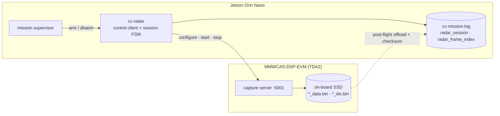

# Phase 10 (proposed) — TI MMWCAS cascaded radar: mission recording + pre-processed streaming

> **Status: design proposal. No code has shipped for this phase.** This document
> exists to be argued with before anything is built. It fixes the hardware
> constraints that actually drive the design, enumerates the three integration
> paths that are physically possible, recommends one order to build them in, and
> writes down the invariants radar must not be allowed to break.

**Goal (as asked):** *start mission recording of radar data* and *stream
pre-processed radar data* into the companion stack, on the same
`drone-companion` chassis that already records FC telemetry — without weakening
a single existing safety property.

**Hardware in scope:** MMWCAS-RF-EVM (4 × AWR2243, 12 TX / 16 RX cascade) +
MMWCAS-DSP-EVM (TDA2Sx capture/processing host, 1 GbE, on-board PCIe SSD),
hanging off the Jetson Orin Nano that already runs `companiond`.

---

## Part 0 — What the hardware actually does (the constraints that drive everything)

Everything below follows from four facts about this platform. They are not
design preferences; they are what the boards do.

| # | Fact | Consequence for us |
|---|---|---|
| 0.1 | **The DSP-EVM captures raw ADC to its own on-board SSD.** 1 GbE is for *control* and for *offloading* captures. TI states there is no live-streaming mode that pushes captured raw data to a host, and explicitly does not recommend raw-over-network. | The recording path is **"the radar records itself; the Jetson records the index"**. Do not design an in-flight raw-to-Jetson pipe. |
| 0.2 | **Raw is ~3 MiB per frame in the standard MIMO config** (12 TX × 16 loops = 192 chirps × 4 RX/device × 256 samples × complex int16 × 4 devices) → **30 MiB/s ≈ 105 GiB/h at 10 Hz**. | Raw never touches the mission volume in flight. Any raw-carrying link must be sized and *measured*, never assumed. |
| 0.3 | **The TDA2 "cascade object detection" real-time demo exists but is EOL.** TI's Processor SDK Radar demos are unsupported, and the shipped version is not compatible with AWR2243 firmware (it targets AWR1243 and needs porting). | Do **not** architect around the TI demo. Define *our* pre-processed contract and treat the producer (TDA2 app / Jetson CUDA / bench simulator) as swappable. |
| 0.4 | **Control is a TCP session to the TDA2 (default `192.168.33.180:5001`)**, driving an mmwavelink-style configure → start → stop sequence; captures land in `/mnt/ssd/<session>/` as `*_data.bin` + `*_idx.bin` per device, retrieved afterwards over the network. | `companiond` can own the whole capture lifecycle from Rust, with **no bulk data path at all** — this is the cheapest useful increment and it is the one that delivers "start mission recording radar data". |

### 0.5 The `*_idx.bin` index is the gift that makes Path A work

Per capture, per device, the TDA2 writes an index file alongside the data:

```
header (24 B):  tag u32 · version u32 · flags u32 · numIdx u32 · dataFileSize u64
per frame (56 B): tag u16 · version u16 · flags u32 · width u16 · height u16
                  pitchOrMetaSize[4] u32 · size u32 · timestamp u64 (ns) · offset u64
```

That gives us, for every recorded frame: **a radar-clock timestamp in
nanoseconds, a byte offset, and a length**. So even when the bulk samples stay
on the radar's SSD, the mission dataset can hold a complete, row-per-frame,
joinable timing record of the capture — which is exactly what the mission log is
for.

### 0.6 Data-volume budget (the table any new stream must update first, per spec §8)

| Tier | Shape (example) | Bytes/frame | @10 Hz | Per hour | Verdict |
|---|---|---|---|---|---|
| **Raw ADC** | 192 chirps × 16 RX × 256 samples × cplx int16 | 3.0 MiB | 30 MiB/s | 105 GiB | SSD-on-board only (0.1) |
| **Raw ADC, reduced** | 32 chirps × 16 RX × 128 samples × cplx int16 | 256 KiB | 2.5 MiB/s | 8.8 GiB | streamable, needs a custom forwarder |
| **T2 range-Doppler-azimuth cube** | 256 × 64 × 86 f32 | 5.4 MiB | 54 MiB/s | 189 GiB | bench/dev only, sheds first |
| **T1 range-azimuth heatmap** | 256 × 128 f32 | 128 KiB | 1.25 MiB/s | 4.4 GiB | streamable + recordable, config-gated |
| **T0 detections** | ≤ 512 dets × 20 B | 10 KiB | 100 KiB/s | 352 MiB | always on; the default product |

These are *design* numbers. Per the spec's budget rule, none of them are allowed
into the spec proper until they are measured on the bench.

---

## Part A — The invariants radar must not break

The existing invariants are not negotiable, and radar is the first subsystem big
enough to threaten them by accident.

1. **PX4 remains the sole flight authority.** Radar is a *payload*. No radar
   product — detection, heatmap, occupancy — becomes an input to PX4 in this
   phase. In particular `OBSTACLE_DISTANCE` / collision-prevention is
   **explicitly out of scope**: sending it would make the companion an input to
   flight control, which invariant 1 and the §13 runtime envelope forbid. If it
   is ever wanted it needs its own spec change, its own policy table, and its own
   staged audit — not a config flag.
2. **Missing data stays missing.** A dropped radar frame is recorded as a gap
   (sequence discontinuity + count), never interpolated. A radar clock offset
   that is not locked yields `age_ns = null`, exactly as the FC path already
   does.
3. **Bulk data can never hurt the safety path.** Separate NIC and subnet from the
   FC link, separate tokio tasks, separate bounded channels, separate disk
   volume and quota, and the radar control socket never shares `cc-link`'s
   priority TX queues. A wedged radar board must be indistinguishable, from the
   safety loop's point of view, from an absent one.
4. **A mission is still readable if radar fails.** Radar failures degrade to
   "no radar rows, reason recorded"; they never abort mission logging, never
   block `Mission::open`, and never change a segment's verdict from Clean.

Two new invariants are needed, specific to radar:

5. **Record the pre-processed output; never recompute it.** Range/Doppler FFTs
   and beamforming (GPU or DSP) are *not* bit-reproducible across drivers,
   architectures, or library versions — so `raw → pre-processed` cannot live
   inside the determinism proof. It is a **recorded transform**: the pre-processed
   frame that was produced in flight is what lands on disk, and replay starts
   from those recorded rows. This generalizes deviation D7 (`link_quality`
   consuming only replayable fields) to a whole subsystem.
6. **A capture is only interpretable with its configuration.** Chirp profile and
   cascade calibration are as load-bearing for radar bytes as `dialect_hash` is
   for MAVLink bytes. Both get hashed, both travel in the manifest, and a
   mismatch at start-up **refuses to record** rather than recording
   uninterpretable samples — the same gate the dialect SHA-256 already applies
   to the wire contract.

---

## Part B — The three integration paths, and the order to build them

### B.1 Path A — Capture controller + capture reference *(recommended first)*

`companiond` owns the radar capture lifecycle over TCP:5001 and records
**metadata only**. Bulk samples stay on the DSP-EVM SSD during flight and are
offloaded afterwards.



* **Delivers:** "start mission recording radar data", completely, with **zero**
  bulk-data risk in flight.
* **Mission dataset gains:** `radar_capture_reference.json` (session id, board
  path, per-device file names, sizes, checksums, profile/calibration hashes,
  frame counts) plus a `radar_session` Parquet stream. This is not a new idea in
  this codebase — it is exactly the precedent already set by
  `px4_ulog_reference.json` in spec §4.6: the bytes may live elsewhere, the
  *joinable record* lives in the mission directory.
* **After offload,** the `*_idx.bin` files are parsed into a `radar_frame_index`
  stream (one row per frame: radar-clock ns, byte offset, size, per-device
  agreement), so the capture becomes queryable and joinable to FC telemetry
  without ever reading a gigabyte of samples.
* **Cost:** no in-flight radar situational awareness. That is what Path B is for.

### B.2 Path B — Pre-processed stream ingest *(the "stream pre-processed data" ask)*

Define a compact, versioned **radar frame contract** and ingest it into the same
shape the FC telemetry already flows through: validate → fan out → record →
(later) consume.

* **Not MAVLink.** A MAVLink 2 payload caps at 253 bytes; a 10 KiB detection
  list or a 128 KiB heatmap in `CC_*` messages would mean hundreds of fragments
  per frame sharing the safety link. Radar gets **its own framing on its own
  subnet** (length-prefixed, CRC'd, carrying a `radar_contract_hash` — same
  discipline as the dialect hash, different wire).
* **Producer-agnostic by construction.** The same contract is satisfied by (a) a
  custom TDA2 app, (b) Jetson-side CUDA over a reduced raw stream (Path C), or
  (c) `tools/phase10/fake_radar.py` replaying a recorded capture. Given fact 0.3,
  producer-swappability is not a nicety — it is the risk mitigation.
* **Tiers** (config-gated, per the budget table): T0 detections always; T1
  heatmap optional; T2 cube dev-only and first to shed.

### B.3 Path C — Jetson-side CUDA pre-processing from a reduced raw stream

Only viable on a *reduced* configuration (0.6: 256 KiB/frame ≈ 2.5 MiB/s is
comfortable on 1 GbE; the full 30 MiB/s is not, and TI says so), and it requires
a custom TDA2 forwarder because live raw streaming is not a supported mode. Put
it behind the Path B contract so the rest of the stack cannot tell which producer
it is talking to, and so a CUDA rewrite never touches the recorder.

### B.4 Recommendation

**Build A first, then B against the fake producer, then B against real hardware,
then C only if in-flight full-resolution products are genuinely needed.** A is
small, fully testable, and delivers the recording ask outright. B's *contract*
is the valuable artifact — the producer behind it is the part most likely to
change (0.3), so it must be the part easiest to replace.

---

## Part C — Proposed architecture

### C.1 Crates

```
crates/
  cc-radar/          control-plane client (TCP:5001), session FSM, profile +
                     calibration hashing, *_idx.bin parser, capture reference,
                     radar shed ladder            [Path A]
  cc-radar-ingest/   frame contract decode → validate → RadarEvent fan-out,
                     per-frame continuity + radar-clock age    [Path B]
  cc-radar-health/   radar-derived advisory findings, own registry [Phase 10.3]
apps/
  radar-inspect/     (or a --radar section in log-inspect) verify radar streams,
                     index ↔ blob consistency, offload checksums
tools/phase10/
  fake_radar.py      control-plane test double + synthetic frame producer
```

`cc-radar-ingest` deliberately publishes a **separate `RadarEvent` fan-out**
rather than extending `TelemetryEvent`. Reason: `cc-ai-health`'s logical clock is
`max(cc_receive_time_ns)` over consumed events, so adding radar events to that
broadcast would perturb the 10 Hz grid of the existing eight algorithms and
invalidate a shipped byte-identical-replay proof for zero benefit. Radar joins at
the *conclusion* layer, not the event layer.

### C.2 Task graph (extends spec §5.2)

```
[radar subnet] ─ cc-radar control task ⇄ TDA2 :5001        (session FSM, low rate)
[radar subnet] ─ cc-radar-ingest task → bounded mpsc → broadcast: RadarEvent
                                                  ├─→ radar log task (own writer)
                                                  └─→ cc-radar-health (Phase 10.3)
mission supervisor ── arm/disarm + mission lifecycle ──→ cc-radar control task
```

Both radar tasks are lossy subscribers of nothing the safety path needs, and
neither is on the FC RX path. The radar log task is a *second* disk-touching
task — acceptable because it writes a *different volume*; if radar shares the
mission volume, it must instead be folded into the existing single writer.

### C.3 On-disk schemas (all under the existing envelope discipline)

New streams, each carrying the identity envelope (§3.4) so they join to FC
telemetry on `(vehicle_id, mission_id, px4_boot_id, …)`:

| Stream | Grain | Key payload columns |
|---|---|---|
| `radar_session` | one row per capture session | `radar_session_id`, `radar_boot_id`, `profile_hash`, `calib_hash`, `opened_cc_ns`, `closed_cc_ns`, `close_reason`, `frames_reported`, `frames_dropped`, `board_fw` |
| `radar_frame_index` | one row per raw frame (post-offload, from `*_idx.bin`) | `frame_seq`, `radar_timestamp_ns`, `device`, `byte_offset`, `byte_len`, `devices_agree` |
| `radar_frame` | one row per **pre-processed** frame | `frame_seq`, `radar_timestamp_ns`, `cc_receive_time_ns`, `seq_gap`, `age_ns` (nullable), `age_locked`, `tier`, `n_detections`, `noise_floor_db`, `proc_flags`, + bulk ref (`shard`, `offset`, `len`, `dtype`, `dims`) |
| `radar_detection` | one row per detection | `frame_seq`, `det_index`, `x`, `y`, `z`, `range_m`, `azimuth_rad`, `elevation_rad`, `doppler_mps`, `snr_db`, `rcs_dbsm` (nullable) |

Design notes:

* **Detections are flat rows, not nested lists.** Variable-length per frame,
  columnar-friendly, and no `FixedSizeList` lie about a width that varies.
* **Bulk tensors (T1/T2) do not go in Parquet cells.** They append to
  length-prefixed `radar_bulk/NNNNNN.bin` shards — reusing the proven
  `raw_mavlink.bin` pattern, including "a torn trailing record after `kill -9` is
  expected and detectable" — and `radar_frame` holds the index into them. This
  keeps Parquet parts small and sealing cheap.
* **Three clocks, stated honestly.** `cc_receive_time_ns` remains the only
  authoritative log clock. `radar_timestamp_ns` is recorded **verbatim, in the
  radar's own time base**. The offset between them is *estimated* by a
  control-plane echo (the same RTT-filtered median estimator `cc-timesync`
  already implements, worth generalizing) and quality-flagged
  LOCKED/DEGRADED/UNLOCKED. Not locked ⇒ `age_ns = null`. Nothing is ever
  back-dated into a clock we do not trust.
* **Hardware frame trigger is the gold standard, and unconfirmed.** If the
  cascade EVM's frame-trigger input can be driven from a PX4 GPIO/PPS, radar
  frames become hardware-aligned to FC time and the estimator becomes a
  cross-check instead of the mechanism. This must be confirmed from SWRU553 /
  the board schematic on the bench before anything is designed around it.

### C.4 Config (`[radar]`, layered exactly like the existing sections)

```toml
[radar]
enable            = false                    # off by default; radar is opt-in
control_addr      = "192.168.33.180:5001"
data_bind         = "0.0.0.0:24050"          # pre-processed ingest (Path B)
profile           = "/etc/companiond/radar/mimo_10hz.toml"
calibration       = "/etc/companiond/radar/calib_2026-05.json"
start_policy      = "armed"                  # off | mission | armed | manual
tiers             = ["detections"]           # detections | heatmap | cube
radar_root        = "/var/lib/companiond/radar"
bulk_shed_low_bytes = 8589934592             # 8 GiB
bulk_resume_bytes   = 12884901888            # 12 GiB
session_cap_secs  = 900
frame_hz_max      = 20.0
control_timeout_ms = 3000
```

Cross-field invariants for `validate.rs`, in the style already there:

* `enable` ⇒ profile and calibration files exist, parse, and hash.
* Radar thresholds are well-ordered *and* **above** `disk.raw_shed_low_bytes`
  when `radar_root` shares a volume with `mission_root` — so **radar bulk always
  gives up disk before `raw_mavlink.bin` does**, which is the correct priority
  (radar bulk is the largest and least safety-relevant thing being written).
* `frame_hz_max × tier_bytes ≤` a declared ingest budget; a config that cannot
  fit is a start-up error, not a runtime surprise.

**Why radar gets its own ladder instead of a new `ShedStage` rung:** `ShedStage`
discriminants are written as `shed_stage: UInt8` into every `events/` part on
disk. Inserting a rung would renumber existing stages and silently reinterpret
already-recorded datasets. A separate two-rung radar ladder over `radar_root`'s
free space (Normal → BulkShed → AllShed), ordered against the mission ladder by
config validation, achieves the same shedding priority with **no on-disk
renumbering**. If a single ladder is ever preferred, the fix is to append the new
variant with a fresh numeric value and replace the derived `Ord` with an explicit
`rank()` — never to renumber.

### C.5 Session lifecycle

| Trigger | Action |
|---|---|
| mission open + `start_policy` satisfied (`armed` = `arming_state` armed from `CC_TELEMETRY_STATE`) | CONFIGURE (profile + calibration, hashes verified) → START → `radar_session` row opened |
| disarm / mission finalize / `session_cap_secs` | STOP → session sealed with `close_reason` → capture reference written atomically (temp + fsync + rename, like the manifest) |
| radar board reboot (board boot id changes) | seal session `radar_reboot`, open a new one — mirrors the `px4_boot_id` segment-rotation rule |
| segment rotation (PX4 reboot / cap) | radar session continues; the frame rows carry the segment's identity, so the join stays exact |
| control-plane timeout / TCP reset | session sealed `radar_link_lost`, reconnect with backoff (100 ms → 2 s cap, as `cc-link` does); mission logging **unaffected** |
| profile or calibration hash mismatch | **refuse to start capture**, record the reason, WARN — never record uninterpretable samples (invariant 6) |

### C.6 Observability

* Status JSON gains a `radar` object: `{state, session, frames, hz, drops,
  bulk_shed, clock, offset_ns, board_free_gib}` — so the SITL/bench harnesses can
  assert radar behaviour from `companiond` stdout, exactly as they do for `log`
  and `safety` today.
* Dialect additions, minimal and additive: `CC_SUBSYS_RADAR = 12` and
  `CC_HF_RADAR = 2048` (both free today), used **only** for radar *self*-health
  ("radar unavailable/degraded", advisory) — never for perception content.
  Optionally `CC_RADAR_SESSION` at **54014** (log-only on the PX4 side, like
  `CC_AI_DIAGNOSTIC`, P2) so the cross-log join from Phase 6.4 can see radar
  sessions in ULog. `54008` stays reserved for `CC_TELEMETRY_ESC` and `54009`
  stays the historical gap — neither gets claimed opportunistically.
  ⚠ Adding enum values means PX4's range-validation gauntlet must accept them
  **first**, or the FC will reject the reports as `CC_REJECT_BAD_RANGE`. Ship the
  fork side ahead of the companion side.
* `log-inspect` gains radar checks: session/frame/detection part reconciliation,
  index-vs-shard consistency (declared `len` inside the shard file), offload
  checksum verification, and a torn-tail allowance identical to raw. Verdicts stay
  the existing three (Clean / Dirty / Corrupt).

---

## Part D — Test & verification plan

The whole point of `tools/phase10/fake_radar.py` is that **radar integration must
be testable in CI with no radar attached** — the same role the pymavlink harness
played in Phase 3 before any Rust existed.

| Layer | Tests |
|---|---|
| Golden vectors | a committed synthetic `*_idx.bin` (header + N frame entries) parsed field-exact — the `_idx` parser gets the same treatment as the wire format |
| Unit | session FSM (every transition in C.5), profile/calibration hash gate, contract decode + CRC + fuzz (never panic, counters match injected faults), schema round-trip, radar ladder ordering + hysteresis, detection quantization round-trip |
| Determinism | recorded radar rows → byte-identical radar findings, x86-64 vs aarch64; and the existing 8-algorithm hash **unchanged** by radar's presence (the separate-fan-out proof) |
| Fault drills | board absent at start · board reboot mid-session · board SSD full · network partition mid-session · frame rate above `frame_hz_max` (drop + count) · malformed frame · bulk shed + resume · offload interrupted then resumed · hash mismatch refusal |
| Soak | 30 min at full configured tier rate: zero unexplained frame gaps, radar rows joinable to FC telemetry within the stated timesync bound, measured disk/CPU/network written back into the §8 budget table as *measured* numbers |

---

## Part E — Phased plan with exit criteria

| Step | Content | Exit criterion |
|---|---|---|
| **10.1** | `cc-radar` control plane + session FSM + capture reference + `radar_session` stream. No bulk path. | On the bench, arm/disarm starts and stops a real capture; the mission dataset is `log-inspect`-Clean and contains the session rows + reference JSON; post-flight offload verified by checksum; all C.5 drills pass. |
| **10.2** | Frame contract + `cc-radar-ingest` + `radar_frame`/`radar_detection` + bulk shards, driven by `fake_radar.py`. | 30 min synthetic soak clean; replay byte-identical; existing test suite and the 8-algorithm determinism hash unchanged. |
| **10.3** | Real producer behind the contract (TDA2 app or Path C), then advisory radar self-health finding (warn-only). | Real-hardware soak clean; budget table filled with measured numbers; radar findings warn-only pending an FP audit on recorded benign flights — the same gate Phase 7 set. |
| **10.4** | *Deferred by design:* any radar → PX4 perception path. | Requires its own spec change, policy table, and staged audit. Not part of Phase 10. |

---

## Part F — Risk register / honest reality check

| Risk | Assessment |
|---|---|
| **Payload reality** | The DSP-EVM is a 160 × 136 mm, 22-layer board needing **12 V at ≥ 3 A**, and it must supply conditioned 5 V to the RF board. The RF+DSP pair is bench-scale mass and power for a small multirotor. Mass, power budget, vibration isolation, and connector retention need a real airframe study before flight; the lighter **AWR2243-2X-CAS-EVM** (2-chip) is the obvious fallback if the 4-chip aperture will not fly. |
| **TI software support** | Processor SDK Radar cascade demos are EOL and not AWR2243-firmware-compatible. Mitigation: our own contract (B.2) and a producer we can replace. |
| **No live raw streaming** | Designed around, not fought: Path A records the index, not the samples. |
| **Shared 1 GbE** | If the FC link ever moves to Ethernet, radar must be on a **separate NIC/subnet** (invariant 3). Non-negotiable. |
| **Cascade calibration drift** | Per-device phase/gain calibration is required for the aperture to mean anything, and it drifts with temperature. Record board temperature if the contract can carry it; hash-gate the calibration file (invariant 6). |
| **Determinism** | Solved by construction (invariant 5): record the pre-processed product; never recompute FFTs in replay. |
| **EMI / self-interference** | Props in the field of view, airframe multipath, and switching supplies near GNSS all need bench measurement before any finding derived from radar is trusted. |

### Open questions to settle on the bench before 10.2

1. Can the cascade EVM's frame start be hardware-triggered from PX4 (GPIO/PPS)?
   If yes, the clock problem largely disappears.
2. What is the TDA2's actual sustained pre-processed egress rate over 1 GbE with
   its capture running concurrently?
3. Does the board expose a boot/session identity we can read for the
   reboot-detection rule in C.5, or must we synthesize one?
4. Offload strategy: pull over the network post-flight, or swap the SSD? At
   105 GiB/h of raw, that choice is an operational constraint, not a detail.

---

## Decision log

| # | Decision |
|---|---|
| **R1** | Radar is a payload; no radar product influences PX4 in Phase 10. `OBSTACLE_DISTANCE`/collision-prevention explicitly deferred to its own spec change. |
| **R2** | Path A (control + capture reference) ships before any bulk data path. |
| **R3** | Pre-processed frames use their own framing on their own subnet, **not** MAVLink (253 B payload cap vs 10–128 KiB products). |
| **R4** | `RadarEvent` is a separate fan-out from `TelemetryEvent`, to preserve the shipped 8-algorithm byte-identical-replay proof. |
| **R5** | Bulk tensors go to length-prefixed shard files + Parquet index rows, reusing the `raw_mavlink.bin` pattern; detections are flat rows. |
| **R6** | Radar gets its own shed ladder over its own volume; `ShedStage` discriminants are **never** renumbered (they are on disk in every `events/` part). |
| **R7** | Profile + calibration hashes gate capture start, mirroring the dialect SHA-256 build gate. |
| **R8** | `cc_receive_time_ns` stays the only authoritative log clock; radar timestamps are recorded verbatim and the offset is estimated + quality-flagged, never fabricated. |
| **R9** | Producer-agnostic contract, because TI's cascade demo path is EOL and cannot be depended on. |
| **R10** | Enum additions (`CC_SUBSYS_RADAR`, `CC_HF_RADAR`, optional `CC_RADAR_SESSION` = 54014) land on the PX4 fork's validation gauntlet **before** the companion emits them. |

---

## Sources

Platform facts in Part 0 are drawn from TI documentation and TI E2E threads, plus
the open-source Linux control tool for these boards:

- [MMWCAS-DSP-EVM User's Guide (SPRUIS6)](https://www.ti.com/lit/ug/spruis6/spruis6.pdf) — board power (12 V ≥ 3 A), dimensions, 1 GbE + on-board SSD roles
- [AWRx Cascaded Radar RF EVM (MMWCAS-RF-EVM) User's Guide](https://manuals.plus/m/6ba4804c928286c03a74aaec1357d3ae037d7d14a929514c18393e8d7160ed68) — 4-device cascade, 12 TX / 16 RX, 5 V conditioning from the host board
- [E2E: streaming raw data from MMWCAS-DSP-EVM in (soft) real time](https://e2e.ti.com/support/sensors-group/sensors/f/sensors-forum/881233/mmwcas-rf-evm-how-to-stream-via-mmwcas-dsp-evm-raw-data-to-a-desktop-computer-and-process-in-soft-real-time) and [E2E: continuous streaming support](https://e2e.ti.com/support/sensors-group/sensors/f/sensors-forum/854512/mmwcas-rf-evm-continuous-streaming-for-the-evm-support) — no live raw streaming mode; SSD capture is the supported path; object data is what network transport is for
- [E2E: ROS GUI in Processor SDK Radar / TDA2x real-time demo](https://e2e.ti.com/support/sensors-group/sensors/f/sensors-forum/1200296/mmwcas-dsp-evm-ros-gui-in-processor-sdk-radar-for-real-time-demo-with-ti-jacinto-tda2x-processing) and [E2E: cascade object detection use case](https://e2e.ti.com/support/sensors-group/sensors/f/sensors-forum/946616/mmwcas-dsp-evm-radar-sdk---cascade-object-detection-sample-usecase) — TDA2 point-cloud demo exists, is unsupported/EOL, and needs porting for AWR2243
- [azinke/mmwave](https://github.com/azinke/mmwave) — Linux control tool for MMWCAS-DSP-EVM + MMWCAS-RF-EVM: Ethernet-only, default `192.168.33.180:5001`, mmwavelink-based, captures to `/mnt/ssd/`, retrieved via SSH/`scp`
- [azinke/mmwave-repack `repack.py`](https://github.com/azinke/mmwave-repack/blob/main/repack.py) — the `*_idx.bin` header/entry layout and `*_data.bin` frame organization quoted in §0.5
- [E2E: master/slave `.bin` data format](https://e2e.ti.com/support/sensors-group/sensors/f/sensors-forum/901469/mmwcas-dsp-evm-what-is-data-format-of-master-slave-bin-files-from-linux-cascade-radar-board) — I/Q packing and RX ordering within a device
