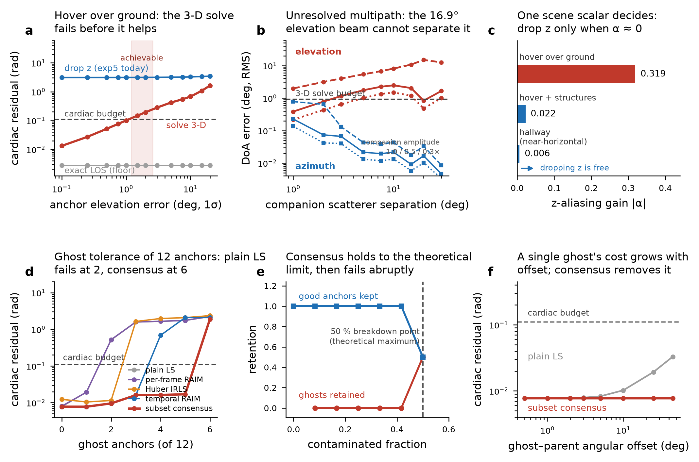

# RBEC exp6/exp7 — the exp5 upgrade pass, re-scoped by measurement

Companion to [`radar_rbec_method.md`](radar_rbec_method.md) and
[`radar_rbec_validation.md`](radar_rbec_validation.md). Code:
`tools/phase10/rbec/exp6_zaxis.py`, `tools/phase10/rbec/exp7_ghost_anchors.py`.
Everything here is **[meas]** in the repo's sense — computed by seeded,
self-testing scripts on this machine, against models whose boundaries are
stated in §A. The tables in this document are the N = 12 grid produced by
`tools/phase10/rbec/exp67_report.py`, archived as
[`results/exp67.json`](results/exp67.json) and plotted below;
`python3 -m tools.phase10.rbec.exp67_report --check` re-runs the grid and
verifies the committed JSON (the module mains print narrower slices —
exp7's own table uses its N = 9 default).

> **Answer up front: two of the four items on the exp5 upgrade list change
> shape.** "Wire elevation steering for a 3-D solve" is **not** the right
> next move — the cascade's elevation aperture is 14× shorter than its
> azimuth aperture, and the binding error is not thermal noise but
> **unresolved multipath**, which the 16.9° elevation beam cannot separate:
> 1.75° RMS elevation DoA error against a 0.94° budget for the 3-D solve.
> The correct fix is scene-conditional and decided by **one computable
> scalar**, the z-aliasing gain α. Separately, the ghost-anchor risk exp5
> flagged is **worse than a quality-gate problem and cheaper to fix than
> expected**: D_A cannot detect a ghost even in principle (it is coherent
> with its parent), a greedy residual test masks at ≥2 ghosts, but **subset
> consensus holds to the 50 % theoretical breakdown point** — zero ghosts
> retained, all good anchors kept, budget met with 5 of 12 anchors
> contaminated.



---

## Part A — Models and their deliberate boundaries

Both experiments reuse `core.py` (K_DISP, band_rms, shaped_noise,
los_from_azel) and `geometry.py` (target_dop), so band definitions, the
Parseval-exact metric, the 0.3 Hz-knee sway model and the budget constants are
identical to exp2/exp3 by construction rather than by restatement. Verified:
exp2 reproduces its published table exactly on this machine
(DOP(u_t) = 0.59 / 0.46 / 0.35, CM-leak = 0.001 on-cone).

**exp6.** Three scenes: `hover_ground` (h = 10 m, ground rings at 6/12/25 m,
casualty at el −30°, i.e. exp2's configuration), `hallway` (near-horizontal
anchors, el ∈ [−5°, +5°] — the geometry exp5 actually ran on), and
`hover_elevated` (rings + three structure anchors). Angle errors are **fixed
per dwell** (systematic), matching exp3's model and the review's finding that
this is the regime that matters. 30 s dwells at 20 Hz, 8 seeds. Estimators:
`oracle3d` (exact LOS — the floor), `radar3d` (LOS perturbed in az *and* el),
`drop_z` (2 unknowns, true dz unmodelled — what exp5 does today).

DoA-accuracy models, on the TIDUEN5A virtual array as transcribed in
`coloradar_bridge.write_fixture` (192 elements; azimuth spans 85 half-λ with
86 unique positions, elevation spans 6 half-λ with **four** distinct positions
{0, 1, 4, 6}): a deterministic CRB (thermal only), a per-channel
calibration-residual Monte Carlo at TI's ±2–3° post-cal figure (SPRACV2), and
an unresolved-two-ray Monte Carlo with random path-length phase per draw.

**exp7.** A ghost is modelled with the property that defines it: the solve
believes its LOS is `U_est[k]`, but the phase it reports follows its
**parent's** LOS, `ghost_offset_deg` away in azimuth. This is a
*wrong-equation* error, not a small-angle one — every error term in exp1–exp4
is a fraction of a degree (T3) or a leakage amplitude (T8). Estimators: plain
LS, Huber IRLS, per-frame RAIM (max-normalised-residual exclusion), temporal
RAIM (dwell-accumulated studentised residual against an absolute threshold),
and subset consensus (RANSAC-style, 200 minimal 4-anchor draws).

**Not modelled.** exp6: range/beam migration, near-field curvature, and the
integer-fixing seam (it inherits exp3/exp4's treatment unchanged — exp6 scores
the *solve*, given tracked phases). exp7: a ghost whose parent is itself a
ghost; ghosts that migrate between range bins mid-dwell; the interaction
between ghost exclusion and the seam-RAIM of exp4 (both consume anchor
redundancy, and the combined availability budget is unquantified).

---

## Part B — exp6: the elevation upgrade is not the upgrade

**B.1 The mechanism is closed-form, not empirical.** With `A2 = K·U[:, :2]`,
the 2-unknown solve returns `d_xy + pinv(U2)·U_z·dz`, so the LOS prediction
error from unmodelled vertical motion is exactly

```
alpha * K * dz(t),    alpha = u_t,xy · pinv(U2) U_z  −  u_t,z        (1)
```

a single scene-computable scalar. Verified to machine precision
(max |predicted − observed| < 1e-9 on all three scenes). **α is the quantity
that should gate the upgrade**, and it is available from the anchor geometry
before any data is processed:

| scene | α | DOP(u_t) | drop-z residual | verdict |
|---|---|---|---|---|
| hallway (near-horizontal) | **+0.006** | 0.356 | 0.062 rad | dropping z is nearly free |
| hover + structures | −0.022 | 0.402 | 0.216 rad | marginal |
| hover over ground | **−0.319** | 0.504 | 3.10 rad | z must be handled |

The physical reading: when the casualty LOS is close to the plane spanned by
the anchor LOS directions, vertical motion aliases into the horizontal
solution *in a way that cancels at the target*. exp5's hallway geometry sits
in exactly that regime — **which is why its 2-D-only harness produced
sub-millimetre increments and a 555 µm held-out residual rather than garbage.
That result was not luck, but it also does not generalise to hover.**

**B.2 What the hardware can actually deliver.** Elevation DoA error by regime,
all on the real 192-element virtual array:

| regime | azimuth | elevation |
|---|---|---|
| Rayleigh beamwidth | 1.19° | **16.92°** |
| CRB, thermal noise only (25 dB/chirp) | 0.0006° | 0.008° |
| + 2° per-channel calibration residual | 0.002° | 0.024° |
| **+ one unresolved companion scatterer at 5°, 0.5× amplitude** | 0.022° | **1.747°** |

The first three rows are the optimistic reading that makes "wire elevation
steering" sound cheap: even with TI's calibration residual, a *point* anchor
is located in elevation to 0.024°, far inside the 0.94° budget. The fourth row
is the one that decides it. A ground-looking anchor is precisely where a
specular companion return sits, and with only four distinct elevation
positions the beam cannot resolve it: the peak is pulled to an amplitude- and
phase-weighted position between the two scatterers, with random sign per dwell
(the path-length phase at λ = 3.8 mm is effectively random). Azimuth resolves
the same pair and stays at 0.02°. Elevation error peaks at **2.48° RMS** near
10° separation — inside the elevation mainlobe, outside the azimuth one.

**B.3 The verdict, per scene.** Two thresholds, both measured:

| scene | σ_el where 3-D stops beating drop-z | σ_el where 3-D leaves budget | achievable σ_el | verdict |
|---|---|---|---|---|
| hover over ground | 37.4° | **0.94°** | 1.75° | **drop z / use IMU** |
| hallway | never (drop-z always fine) | 1.36° | 1.75° | **drop z** |
| hover + structures | 2.47° | 1.21° | 1.75° | **drop z** |

In all three scenes the achievable elevation error exceeds the budget
threshold. The 3-D solve is not *catastrophic* in hover-over-ground — at
1.75° it lands at ~0.17 rad, versus 3.10 rad for naive drop-z — but it does
not meet the cardiac budget, so **"wire elevation steering" buys a 17×
improvement that is still a failure.** Naive drop-z is worse. Both lose.

**B.4 What to do instead.** The exp6 code includes the alternative and it is
the cheap one: an **IMU vertical pseudo-observation**. Vertical motion is the
axis a barometer/rangefinder/IMU stack measures *well* (it is the axis with a
gravity reference and, on a UAV, usually a downward rangefinder), and the
solve needs it only to ~α⁻¹ × budget precision. The recommendation for the
exp5 upgrade pass is therefore:

1. **Compute α from the anchor geometry** and report it per dwell — one line,
   no new machinery. It tells you whether z matters at all *before* you spend
   effort on it.
2. **Where |α| is small (hallway-like, α < ~0.02): keep the 2-D solve** and
   state the α bound as the justification. exp5's existing result stands, with
   a quantitative reason rather than a caveat.
3. **Where |α| is large (hover-like): constrain z from the IMU/rangefinder**,
   not from elevation beamforming.
4. **Do not invest in elevation super-resolution** for this purpose. The
   binding term is multipath-induced bias, not resolution or SNR — MUSIC/ESPRIT
   on four distinct elevation positions cannot separate two sources either.

**B.5 Honest negative and caveats.** The two-ray model uses a single companion
with a uniformly random relative phase; a real specular ground bounce has a
geometry-determined phase and amplitude that partially predicts, so a
model-based correction might recover some of the loss (untested — it needs
V2 bench data). The α analysis assumes the target LOS is known; α itself
depends on the casualty's elevation, which is measured with the same weak
aperture, so **α has its own error bar that this experiment does not
propagate** — worth doing before the number is quoted in a paper.

---

## Part C — exp7: the ghost-anchor error class, and its estimator

**C.1 D_A cannot catch a ghost, in principle.** The C.4 admission rules lean
on PS-InSAR amplitude dispersion (D_A < 0.25). A sidelobe/ring ghost is a
deterministic linear function of its parent's complex echo, so its amplitude
is as stable as the parent's:

| cell | D_A | passes gate? |
|---|---|---|
| parent scatterer | 0.031 | yes |
| **coherent ghost (−26 dB)** | **0.031** | **yes** |
| incoherent clutter | 0.518 | no |

D_A separates *coherent from incoherent*, which is what Ferretti designed it
for. It has no power to separate *correctly-attributed from
mis-attributed* coherent returns. **The C.4 gates as written would admit every
ghost in exp5's anchor list.** The discriminator has to be the solve residual
or the co-range/co-Doppler signature — not any amplitude statistic.

**C.2 The cost, and why the obvious robust estimators fail.** Cardiac in-band
residual, 12 anchors, ghost offset 25°, 6 seeds. First ghost count that
exceeds the 0.110 rad budget:

| estimator | fails at | residual at 1 / 3 / 5 ghosts (rad) |
|---|---|---|
| plain LS | **2 ghosts** | 0.019 / 1.586 / 1.753 |
| per-frame RAIM | 2 ghosts | 0.019 / 1.586 / 1.753 |
| Huber IRLS | 3 ghosts | 0.010 / 1.640 / 2.085 |
| temporal RAIM | 4 ghosts | 0.008 / 0.016 / 2.092 |
| **subset consensus** | **6 ghosts (= 50 %)** | **0.008 / 0.016 / 0.017** |

Three mechanisms, each measured rather than assumed:

1. **Per-frame RAIM is useless here — it is the wrong statistic.** Within a
   single frame a ghost biases the *whole* solve, inflating every anchor's
   residual, so a MAD threshold computed from those residuals never trips
   (measured: it excludes essentially nothing, and its residual matches plain
   LS to three digits). Over a dwell, by contrast, the ghost is unambiguous:
   accumulated studentised residual RMS 15.8 versus 0.02–9.8 for the good
   anchors — **rank 1 of 9**. The statistic must be temporal.
2. **A MAD threshold masks at ≥2 outliers** — the ghosts inflate the very
   scale they are compared against. The fix is that the threshold is known
   *a priori*: a good anchor's residual is
   `sqrt(sigma_phi² + (K·sigma_theta·|d_perp|)²)` — phase noise plus the T3
   term, i.e. the same variance model the angle-aware WLS weights already
   use. Thresholding on `sigma_phi` alone discards ~45 % of good anchors
   (measured); including the T3 term recovers **100 % good retention with 0 %
   ghost retention** at one ghost.
3. **Greedy exclusion still masks at ≥2; subset consensus does not**, because
   it never fits the contaminated set. A minimal 4-anchor draw that happens to
   be ghost-free is clean by construction, and the consensus count finds it.
   Breakdown is at exactly **50 %** (6 of 12) — the theoretical maximum for
   consensus estimation, and the failure is abrupt rather than gradual
   (0.017 rad at 5 ghosts, 1.90 rad at 6).

**C.3 Ghost–parent offset.** A ghost's damage grows with its angular offset
from its parent (plain LS: 0.008 rad at 0.5°, 0.019 at 25°, 0.033 at 45°),
because the offset *is* the error in its assumed sensitivity vector. Subset
consensus holds **0.0077 rad flat at every offset tested** (0.5°–45°), by two
different routes (measured retention): at ≥ 2° it excludes the ghost outright
(retention 0), while at ≤ 1° it *retains* it (retention 1.0) — and is right
to, because at 0.5° a ghost and a merely angle-mismeasured good anchor are
genuinely equivalent, so the retained ghost does no harm.

**C.4 What this changes.** The anchor-admission rule gains a stage that is
*not* a per-cell gate:

- **C.4 keeps D_A** for its actual job (rejecting incoherent clutter) but must
  stop being cited as ghost protection.
- **Add a co-range/co-azimuth structural pre-filter**: exp5's own diagnostic —
  clusters of anchors at identical range — is the cheap ghost detector, and it
  runs before any solve.
- **Make the estimator robust rather than the gate perfect**: subset consensus
  over minimal anchor subsets, with the agreement tolerance set from the known
  `sigma_phi` + T3 variance model. This is a ~15-line change to the solve and
  it absorbs up to 50 % contamination.
- **Report the consensus set size per dwell** as an availability metric.

**C.5 Honest caveats.** The consensus tolerance uses the true `sigma_az/el`
that generated the data; in practice it comes from the DoA error budget, and a
mis-specified tolerance will trade ghost retention against good-anchor
retention (unswept). Consensus cost is 200 minimal solves per dwell — trivial
against the compute budget of §F.4, but it is 200× the LS cost, and the draw
count needed grows with contamination fraction. And exp7's ghosts are static
in angle for the whole dwell; a ghost that appears mid-dwell (as the platform
moves and a sidelobe sweeps a strong scatterer) is a **detection-latency**
problem this experiment does not model, and it interacts with anchor
re-association in C.4.

---

## Part D — Follow-ups, in order

1. **Propagate α's own uncertainty** (§B.5) before quoting the drop-z
   justification in the paper: α depends on the casualty elevation, measured
   with the same weak aperture.
2. **Re-run exp5 with α reported and the consensus solve wired in** — both are
   cheap and both are pure additions to the existing harness. Expected effect
   on the published exp5 numbers: the identical-range anchor clusters get
   excluded, so the 555 µm held-out residual should *improve*; if it does not,
   the clusters were not ghosts and that is itself informative.
3. **Combine consensus with exp4's seam-RAIM and re-measure availability.**
   Both consume anchor redundancy (consensus discards up to half the anchors;
   seam-RAIM needs enough unambiguous anchors to LS-solve the shared IMU
   error). The combined requirement on anchor count is unquantified and may
   exceed 9.
4. **V2 bench question, now sharper**: measure whether ground anchors at
   realistic depression angles actually present unresolved companion returns,
   and at what amplitude ratio. That single measurement decides whether §B's
   1.75° figure is pessimistic or optimistic, and it is a static, cheap,
   ground-based measurement.
5. **Mid-dwell ghost onset** (§C.5) — the detection-latency case.
